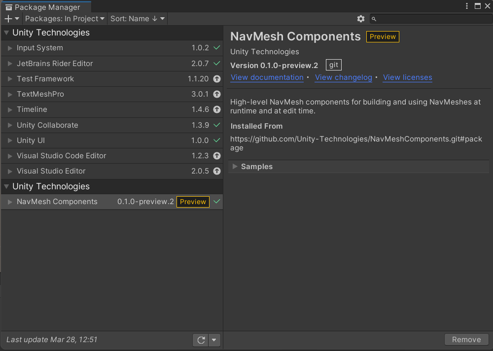

# 🎮 **Custom Roll-A-Ball Game**  
*by Alejandro González*

This is my customized version of the classic [Roll-A-Ball tutorial](https://learn.unity.com/project/roll-a-ball)!

This project has been created using Unity 2020.2.4f1.

> [!IMPORTANT]
> As the tutorial was designed to use Unity 2022.3, there are some elements that have changed, and in order to apply them in Unity 2020.2.4f1, please follow [Development](#-development) section.

## 🔧 **Modifications to the Base Game**

TBD

## 🏁 **Getting Started**
You can play the game by following these simple steps:

1. **Download the Game Build:**
   - Visit the [Releases](https://github.com/alejandrogonzalez14/Custom-Roll-A-Ball/releases) section of this repository.
   - Download the latest release package suitable for your platform (e.g., Windows, macOS, or Linux).

2. **Extract the Files:**
   - After downloading the package, extract the files to a location on your computer.

3. **Launch the Game:**
   - Navigate to the extracted folder and run the executable file.

## 👨‍💻 Development

When in Section [Adding AI Navigation - 2. Install the AI Navigation package](https://learn.unity.com/tutorial/adding-ai-navigation?uv=2022.3&projectId=5f158f1bedbc2a0020e51f0d#64cd0d8bedbc2a798e423cb7) of the tutorial, you are asked to install the AI Navigation package, you'll see that it is not available. Therefore, to install it, you need to follow these steps:

- Go to **Window** > **Package Manager** to open the Package Manager window.
- Click the **Add** dropdown menu, select **Add Package from Git URL...**
- Enter this URL:

   ```
   https://github.com/Unity-Technologies/NavMeshComponents.git#package
   ```

   Then click **Add**. This will install the *NavMesh Components* package. Wait until it finishes installation.
   If installation is succesful, your Package Manager in the **In Project** section should look similar to this:

   

- If that's the case, you can close the Package Manager window.

## 📜 **License**
This project is open-source under the MIT License. See [LICENSE](LICENSE) for details.